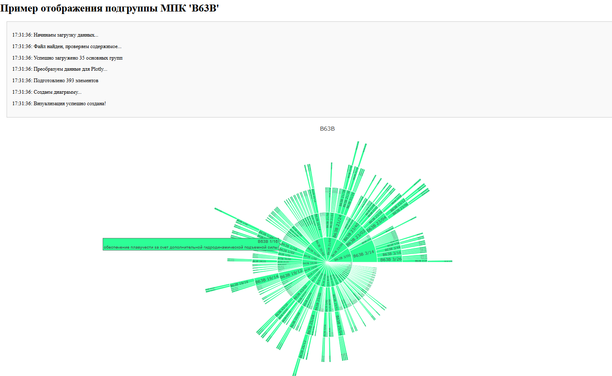
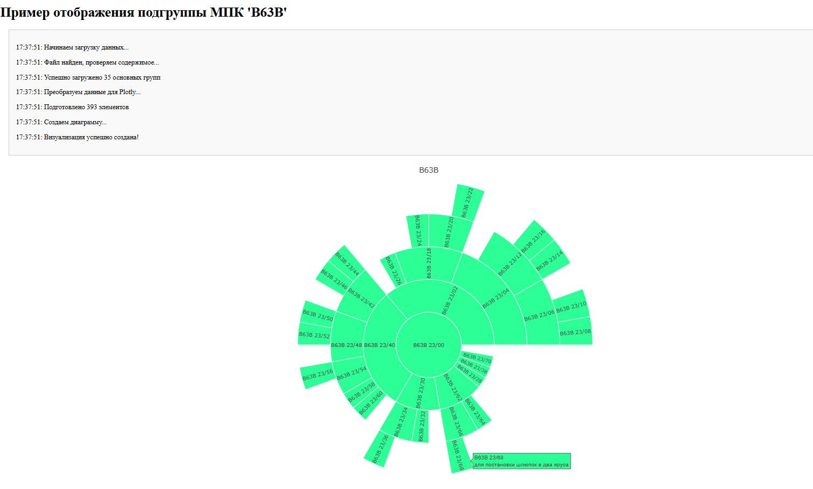
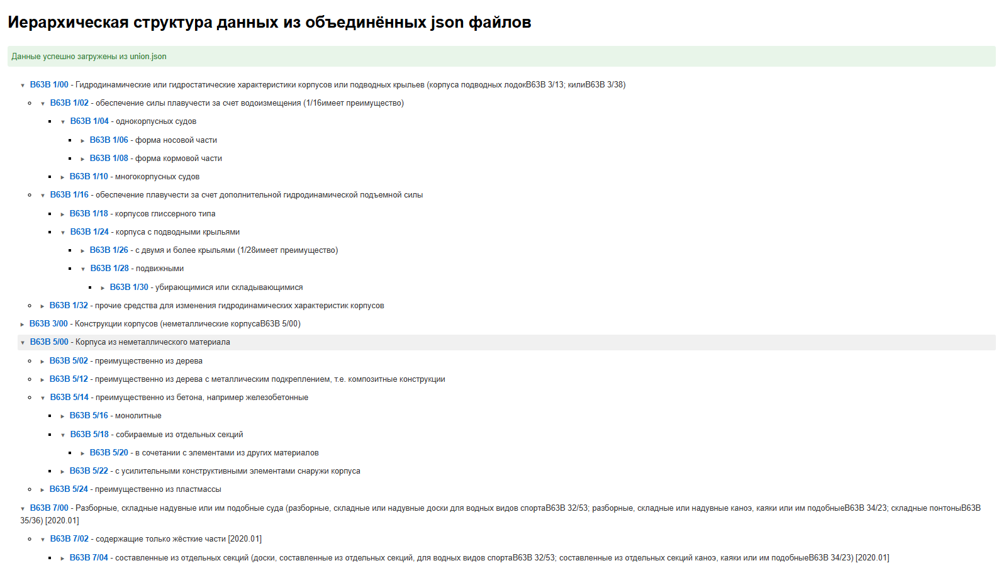

### Парсер fips.ru ###

Для запуска - склонируйте проект командой git clone https://github.com/ant4p/fips_parsing.git  
Создайте виртуальное окружение. 
Установите в виртуальное окружение файл requirements.txt командой pip install -r requirements.txt 
 
Файл .env_example замените на .env c вашими данными:  
-- не меняются -- 
BASE_URL="https://www.fips.ru/publication-web/classification/mpk" - основа для парсинга международной патентной классификации 
EDITION='2025' - данные для GET запроса по году 
-- меняются при необходимости -- 
FOLDER_WITH_JSON_PATH="json_files/" - папка в которой будут сохраняться json файлы, в корне проекта 
OUTPUT_JSON_FILE="union.json" - название файла с конечным результатом 
INPUT_MPK_FILENAME = "Подклассы МПК.xlsx" - файл с данными подклассов МПК 
 
Запустите проект в корневой папке командой python main.py 
При текущих вводных данных, а именно поиск по 32ум подклассам МПК: 
время работы парсера около 47,5-48 секунд: из них 32 секунды -  
timeout между запросами, 15-16 секунд чистое время работы. 
На выходе получаем папку с файлами json по каждому виду МПК, 
а так-же общий union.json файл на чуть больше 38000 строк, который создаётся в корне проекта 
Все из созданных json файлов имеют иерархическую структуру, и могут содержать 
многоуровневые вложенные подгруппы 
 
 
 
Описание програмного решения: 
Процесс парсинга сайта fips.ru декомпозирован на задачи: 
1. Выделить модули кода согласно логике, чтобы можно было их легко заменять или переиспользовать. 
Так в файлах: 
parser_mpk - находится сам парсер 
utils.py - находятся функции которые осуществляют обработку сырых дынных 
script.py - находятся функции которые осуществляют обработку уже готовых данных полученных путём парсинга, при желании эти функции можно переписать на скрипты bash или powershell  
main.py - основной файл проекта, точка входа, в котором весь процесс ETL данных собирается из модулей.
2. Получаем список МПК из файла, по которым будем осуществлять сбор информации 
3. Используем парсер для получения сырых данных и сохранения их в датафрейме pandas проходясь по каждому элементу из полученного списка МПК 
4. Сохраняем данные в json формате для каждого конкретного МПК в отдельной папке 
5. Получаем список сохранённых json файлов и объединяем в один общий json файл. 
6. Замеряем время работы всей сборки и выборочно проверяем полученные данные. 
7. При желании проверяем полученные данные на интерактивной диаграме plotly или древовидной структуре tree.html файла. 
 
 
Для того, чтобы наглядно проверить полученные данные в папке output присутствуют 2 html файла: 
plotly.html - настроен на круговую иерархическую интерактивную диаграмму по файлу 'B63B.json'  
соответственно вы можете воспользоваться им после парсинга 
 

 

 

 

 
tree.html - настроен на показ иерархической древовидной структура распарсеных данных 
из объединённого файла union.json, который соответственно будет доступен тоже после парсинга 
 

 

 
Обе html страницы будут корректно работать на localhost при использовании Live Server. 
 
Для сервиса использованы: 
python3.12 - ЯП 
python-dotenv переменные окружения .env 
bs4 - для извлечения данных 
pandas - обработка данных 
openpyxl - обработка данных для .xlsx файлов 
plotly - интерактивная диаграмма через cdn 
os, time, requests, json - стандартные python библиотеки 
live server - для локального просмотра html страниц
 
